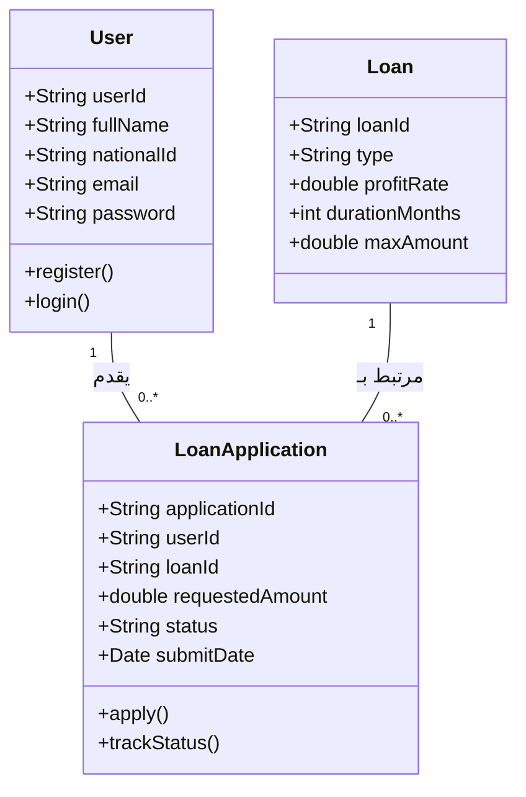
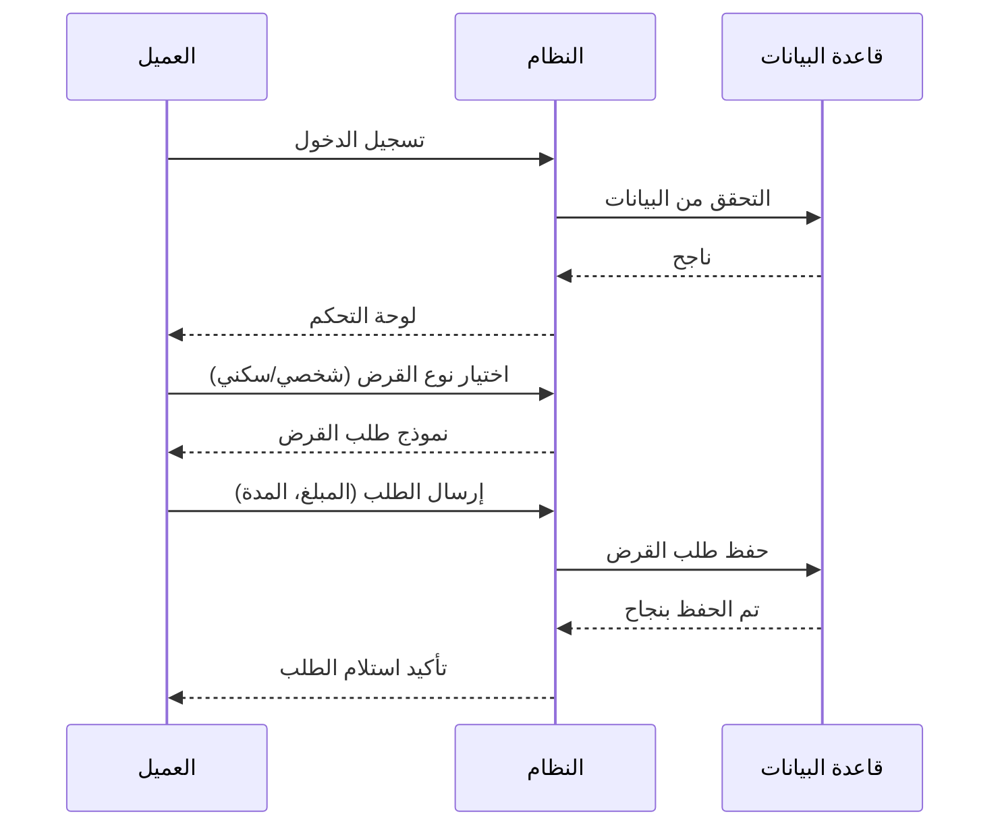

# توثيق نظام القروض - بنك الاستثمار (Investment Bank)

هذا المستند يحتوي على المخططات الهندسية (UML) لنظام القروض عبر الإنترنت، كما هو مطلوب في مشروع هندسة البرمجيات.

## 1. مخطط حالات الاستخدام (Use Case Diagram)
يوضح التفاعل بين العميل (Customer) والنظام.

```mermaid
useCaseDiagram
    actor "عميل البنك" as Customer
    actor "موظف البنك" as Employee

    package "نظام القروض" {
        usecase "إنشاء حساب" as UC1
        usecase "تسجيل الدخول" as UC2
        usecase "استعراض أنواع القروض" as UC3
        usecase "تقديم طلب قرض" as UC4
        usecase "متابعة حالة الطلب" as UC5
        usecase "مراجعة الطلبات" as UC6
    }

    Customer --> UC1
    Customer --> UC2
    Customer --> UC3
    Customer --> UC4
    Customer --> UC5
    Employee --> UC6
    Employee --> UC2
```

## 2. مخطط الأصناف (Class Diagram)
يوضح هيكل البيانات والعلاقات بين الكيانات.



## 3. مخطط التتابع (Sequence Diagram)
يوضح عملية تقديم طلب القرض.



## 4. مخطط المكونات (Component Diagram)
يوضح معمارية النظام البرمجية.

```mermaid
componentDiagram
    [واجهة المستخدم (React)] as UI
    [محرك القواعد (Business Logic)] as Engine
    [نظام المصادقة (Auth Service)] as Auth
    [قاعدة البيانات (Supabase/PostgreSQL)] as DB

    UI ..> Auth : استخدام
    UI ..> Engine : طلبات
    Engine ..> DB : تخزين/استرجاع
    Auth ..> DB : التحقق من الهوية
```
